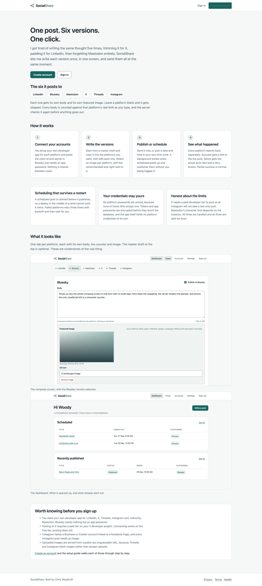
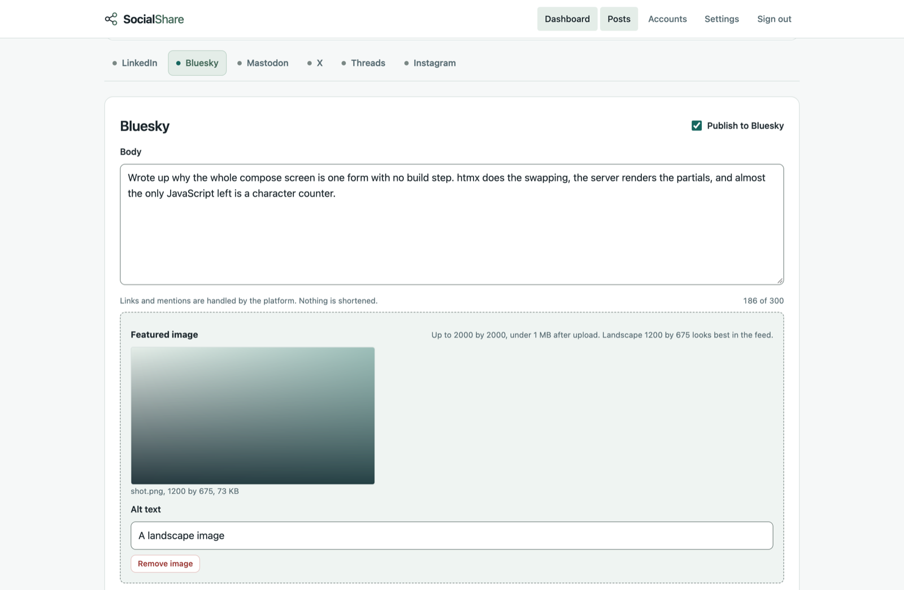

# SocialShare

I write one post, in six versions, and send them all at once.

SocialShare is a small ASP.NET Core app that lets me compose a separate body and featured image
for LinkedIn, Bluesky, Mastodon, X, Threads and Instagram on one screen, then publish them
immediately or schedule them for a time in my own zone. Every platform reports back separately,
so a post can be partly successful and I can retry just the one that failed.



## What it does

- One post, six independent bodies, one featured image per platform. Leave a platform blank and
  it gets skipped.
- A master draft box that copies into every enabled platform, with an inline warning before it
  overwrites anything.
- Live character counts against each platform's real limit, checked again on the server before
  anything is published.
- Publish now, or schedule. A background worker picks scheduled posts up without me being signed in.
- Per platform results with the live post URL on success and the actual error text on failure,
  plus three automatic retries with backoff and a manual retry button after that.
- Each user brings their own developer app credentials. Everything secret is encrypted before it
  touches the database, and the app itself holds no platform credentials.



## Local setup

You need the .NET 10 SDK. Nothing else: no Node, no build step, no database server.

1. `git clone` this repo and `cd` into it.
2. `dotnet restore`
3. `dotnet run --project src/SocialShare.Web`
4. Open the URL it prints, usually `https://localhost:7204`.
5. Click Create account. The SQLite file and the uploads folder are created on first start under
   `src/SocialShare.Web/App_Data`.
6. Confirm the email. Nothing is actually sent in development, so find the confirmation link in
   the console window running the app and open it. Then sign in.
7. Go to Accounts and set up Bluesky. It only needs your handle and an app password, which you
   create in Bluesky under Settings, Privacy and security, App passwords. Save, then Connect.
8. Go to Posts, write a post, tick Publish to Bluesky, and press Publish now.

Every other platform needs a developer app you register yourself.
[docs/platform-setup.md](docs/platform-setup.md) walks through all six.

Email is not sent in development. Confirmation and password reset links are written to the
console instead, so look in the window running the app. If you lose one,
`/resend-confirmation` sends another. To send real mail, see
[docs/email-setup.md](docs/email-setup.md).

### Sign ups are closed by default

`App:RegistrationEnabled` ships as `false` and `App:RequireConfirmedAccount` ships as `true`, so
a deployed instance is shut to strangers out of the box. Development overrides registration back
on in `appsettings.Development.json`, which is why step 5 works on a fresh clone.

That means a new deployment has nobody in it and no way to sign up. Open registration long
enough to create your own account, then close it again. The sequence is in
[docs/operations.md](docs/operations.md#creating-the-first-account).

### If the build suddenly fails with Razor errors

If `dotnet build` starts reporting errors in `.cshtml` files that you did not touch, especially
`RZ1021` about markup in a code block, or `The name 'odel' does not exist`, the code is almost
certainly fine. The Roslyn compiler server, `VBCSCompiler`, occasionally gets into a state where
the Razor source generator mis-parses markup inside `@if` and `@foreach` blocks, and every build
routed through that process fails identically until it exits.

```
dotnet build-server shutdown
```

That clears it. The tell is that the same commit builds fine in a container or in CI, and that
`UseSharedCompilation=false dotnet build` succeeds while a plain `dotnet build` does not.

## Running the tests

```
dotnet test
```

That runs everything, including integration tests that boot the real app against a throwaway
SQLite file. [docs/testing.md](docs/testing.md) says what is covered.

## Configuration worth knowing

Everything has a working default. These are the ones I actually change.

| Setting | Default | What it does |
|---------|---------|--------------|
| `ConnectionStrings:Default` | `Data Source=App_Data/socialshare.db` | Where the SQLite file lives. |
| `Storage:ImageRoot` | `App_Data/uploads` | Where uploaded images live. |
| `Storage:MaxImageBytes` | `8388608` | Upload size cap. |
| `DataProtection:KeyRingPath` | empty | Where the encryption key ring is persisted. Must be set in Azure. |
| `App:PublicBaseUrl` | empty | Absolute base URL. Threads and Instagram fetch images from it. |
| `App:RequireConfirmedAccount` | `true` | An account must confirm its email before it can sign in. |
| `App:RegistrationEnabled` | `false` | Whether anybody can create an account. Development overrides this to `true`. |
| `App:AdminEmails` | `[]` | Emails that get the admin role on the next start. |
| `Scheduler:PollSeconds` | `15` | How often the worker looks for due posts. |
| `Retention:PurgeEnabled` | `false` | Turn on to delete published posts after N days. |
| `Email:Provider` | `Log` | `Log` writes messages to the log. `SendGrid` actually sends. Anything else stops the app. |
| `Email:SendGridApiKey` | empty | A SendGrid API key with Mail Send permission. Required when the provider is SendGrid. |
| `Email:FromAddress` | `no-reply@socialshare.local` | Must be on a sender identity you verified with SendGrid. |
| `Email:SandboxMode` | `false` | Ask SendGrid to validate every message and deliver none of them. |

Use user secrets locally and App Service application settings in Azure. Nothing secret belongs
in a config file in the repo.

## Docs

- [Architecture](docs/architecture.md), including the diagrams and why the projects are split the way they are
- [Decision records](docs/adr/)
- [Email setup](docs/email-setup.md), getting SendGrid sending
- [Platform setup](docs/platform-setup.md), one section per platform
- [Azure deployment](docs/azure-deployment.md)
- [Operations](docs/operations.md), backups, key rotation, logs and common failures
- [SaaS roadmap](docs/saas-roadmap.md), what would have to change to sell this
- [Testing](docs/testing.md)

## The shape of it

```
SocialShare.sln
src/SocialShare.Web/        Razor Pages, htmx, CSS, Identity pages
src/SocialShare.Core/       Entities, the DbContext, ISocialPlatform, services, the scheduler
src/SocialShare.Platforms/  One implementation per platform
src/SocialShare.Data/       Migrations, the disk image store, secret encryption
tests/SocialShare.Tests/    xUnit unit and integration tests
docs/                       Everything above
.github/workflows/          Build, test and deploy
```

One solution, no microservices, no message bus, no repository layer over EF. It is a small app
and it is built like one.
