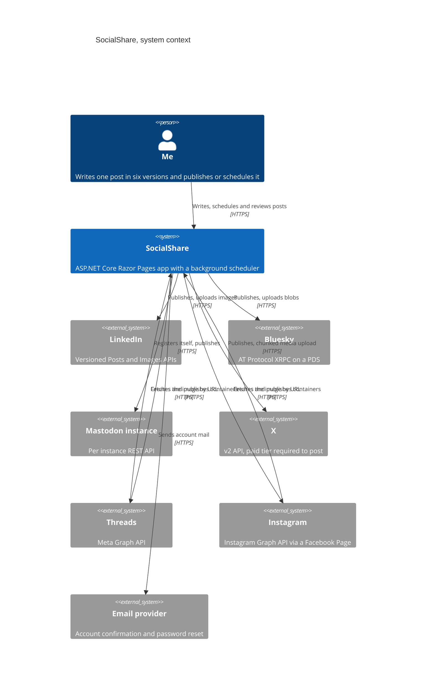
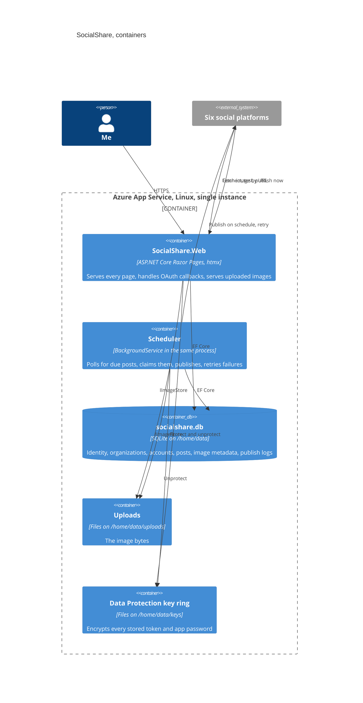
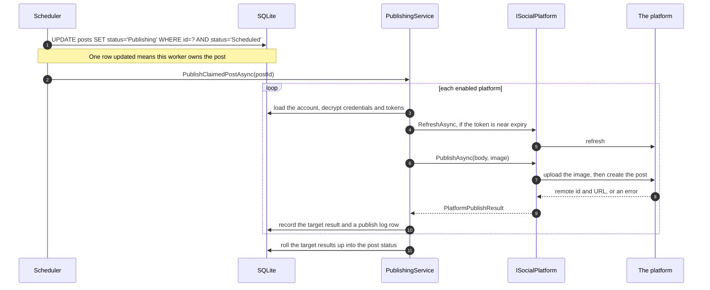

# Architecture

SocialShare is a modular monolith. One solution, one process, one SQLite file. That is not a
compromise I am apologising for, it is the right size for what this does.

## C4 level 1: context



The two arrows pointing back at SocialShare are the reason uploaded images are served from a
public address. Meta does not accept an upload for these two endpoints, it fetches the image
itself. See [operations.md](operations.md) for the privacy tradeoff that creates.

## C4 level 2: containers



The worker is not a separate container. It is a `BackgroundService` in the same process, which
is why the App Service plan needs Always On.

## Projects and why they are split that way

```
src/SocialShare.Core/       Entities, enums, the DbContext, ISocialPlatform, services, the scheduler
src/SocialShare.Platforms/  One folder and one class per platform, plus shared HTTP plumbing
src/SocialShare.Data/       Migrations, the disk image store, Data Protection secret encryption
src/SocialShare.Web/        Razor Pages, htmx, CSS, Identity pages, health checks, the image endpoint
tests/SocialShare.Tests/    Unit and integration tests
```

The reference split in the brief put the `DbContext` in `SocialShare.Data`. I moved it to
`SocialShare.Core` and left migrations in `SocialShare.Data`, because the services and the
scheduler live in Core and they talk to the database directly. With the `DbContext` in Data, Core
would have had to depend on Data or I would have had to invent an interface over EF just to break
the cycle. That interface would be a repository in a hat, and the brief says no repository over
EF. So Core owns the model and the context, Data owns migrations and the two infrastructure
implementations that need external packages. That is recorded in
[ADR 0006](adr/0006-dbcontext-in-core.md).

`SocialShare.Platforms` references only Core, so a platform implementation can never reach the
database. It is handed the decrypted credentials and tokens, the body, and an image. It hands
back a result. That is the whole contract.

## How a publish actually flows



The claim is the whole reason a restart in the middle of a send cannot double post. It is a
single conditional `UPDATE`, so only one caller can ever win it. Anything left in `Publishing`
for longer than `Scheduler:StuckClaimMinutes` is released on a later tick and tried again.

## Tenancy

Every owned row carries a `UserId` and an `OrganizationId`. The `DbContext` applies a global
query filter on `UserId` driven by a scoped `TenantContext`, which request middleware sets from
the signed in user. The background worker explicitly puts the context into system mode, which is
the only way past the filter, along with the admin page and a handful of deliberate
`IgnoreQueryFilters` calls that are each commented.

Every user gets an `Organization` on registration, with a `Plan` of `Free` or `Pro`. Team
features are not built. The schema is shaped for them so adding them later is additive rather
than a migration of every table.

## What is deliberately not here

- No microservices, no message bus, no CQRS, no MediatR.
- No repository or unit of work over EF Core. Pages query the `DbContext`.
- No SPA framework and no build step. htmx plus Razor partials.
- No job scheduler library. A `BackgroundService` and a `PeriodicTimer`.
- No imaging library. A hand written magic byte reader, because all it has to do is tell a real
  JPEG, PNG or WebP from something renamed to look like one, and read the dimensions.
