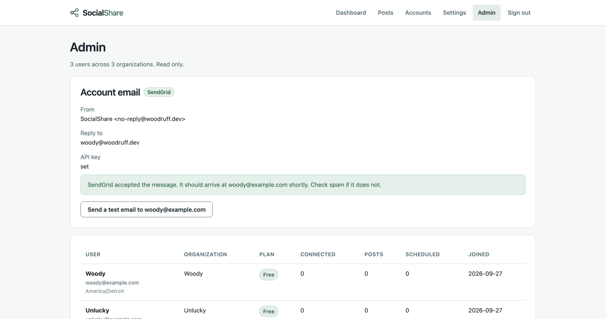

# Email setup

The app ships with `Email:Provider` set to `Log`, which writes confirmation and password reset
messages to the application log instead of sending them. That is fine while it is only you. It
stops being fine the moment anyone else needs an account, because `App:RequireConfirmedAccount`
is on by default and nobody can sign in until they click a link they never received.

This is how to make it actually send.

## What you get for the effort

| | Provider is Log | Provider is SendGrid |
|---|---|---|
| Confirmation link | in the server log | in the person's inbox |
| Password reset | in the server log | in the person's inbox |
| Somebody else can register | no, not really | yes |
| Cost | nothing | nothing, at this volume |

SendGrid's free tier is 100 emails a day. A single user app sends a handful a year.

## 1. Create the SendGrid account and verify a sender

SendGrid will not send anything from an address it has not verified. This is the step people
skip, and it is the cause of the most common failure.

1. Sign up at <https://signup.sendgrid.com>.
2. Go to Settings, Sender Authentication.
3. Pick one:
   - **Single Sender Verification** is the quick one. Verify one address, for example
     `no-reply@yourdomain.com`, by clicking a link sent to it. Good enough to get going.
   - **Domain Authentication** is the better one. You add CNAME records to your domain's DNS,
     and after that any address on that domain can send. It also makes your mail far less likely
     to land in spam, because it sets up DKIM and SPF properly.

   If you have the DNS access, do Domain Authentication. Deliverability is the whole game with
   transactional email and Single Sender does not help it much.
4. Note the exact address you verified. That is what goes in `Email:FromAddress`.

## 2. Create an API key

1. Settings, API Keys, Create API Key.
2. Name it something you will recognise later, like `socialshare-production`.
3. Choose **Restricted Access** and grant **Mail Send** only. Nothing else. A key that can only
   send mail is worth much less to somebody who steals it than a full access key.
4. Copy the key. SendGrid shows it exactly once.

## 3. Configure it

### Locally

Use user secrets, so the key never touches a file in the repo:

```bash
cd src/SocialShare.Web
dotnet user-secrets set "Email:Provider" "SendGrid"
dotnet user-secrets set "Email:SendGridApiKey" "SG.your-key-here"
dotnet user-secrets set "Email:FromAddress" "no-reply@yourdomain.com"
dotnet user-secrets set "Email:FromName" "SocialShare"
```

### On Azure

```bash
RG=socialshare-rg
APP=socialshare-woody

az webapp config appsettings set --name $APP --resource-group $RG --settings \
  Email__Provider=SendGrid \
  Email__SendGridApiKey="SG.your-key-here" \
  Email__FromAddress="no-reply@yourdomain.com" \
  Email__FromName="SocialShare" \
  Email__ReplyToAddress="you@yourdomain.com"
```

If your SendGrid account is on EU data residency, also set
`Email__SendGridHost="https://api.eu.sendgrid.com"`. Leave it empty otherwise.

`Email__ReplyToAddress` is optional and worth setting. Without it, a reply to a confirmation
email goes to the no-reply address and nobody reads it.

## 4. Prove it works

Sign in as an admin and open `/admin`. The Account email panel shows which provider is active,
which address it sends from, and whether a key is set. Press **Send a test email** and it sends a
real message to your own address.

If it worked, the panel says SendGrid accepted the message. If it did not, the panel shows the
reason SendGrid gave, verbatim.



You can also prove the credentials without emailing anybody, by turning on sandbox mode:

```bash
az webapp config appsettings set --name $APP --resource-group $RG --settings Email__SandboxMode=true
```

SendGrid then validates every message, including the sender identity, and delivers none of them.
Turn it off again when you are done, or nothing will ever arrive.

## How failures behave

The app does not quietly pretend an email was sent.

- **A misconfiguration stops the app at startup.** `Email:Provider` set to something that is not
  `Log` or `SendGrid`, or set to `SendGrid` with no API key or with the placeholder from address
  still in place, and the app refuses to start with a message saying which one it is. That is
  deliberate: silently falling back to the log means nobody can register and there is no clue.
- **A refused message throws.** The status code and SendGrid's own response body end up in the
  log, and `EmailSendException` carries them.
- **Registration stays honest.** If the confirmation email cannot be sent, the account is still
  created, but the page says the email could not be sent instead of telling somebody to check an
  inbox that will stay empty.
- **The resend and forgot password pages stay quiet.** They answer identically whether or not the
  address belongs to an account, so they cannot be used to find out who has one. A failure there
  goes to the log only. That is a deliberate trade: the operator finds out, the visitor does not.

## Common failures

| What the error says | What it means |
|---|---|
| `403 ... does not match a verified Sender Identity` | `Email:FromAddress` is not the address you verified in step 1. |
| `401 ... authorization grant is invalid` | The API key is wrong, or it was revoked. |
| `403 ... access forbidden` | The key exists but has no Mail Send permission. |
| `Could not reach SendGrid` | Outbound HTTPS is blocked, or DNS is failing. |
| Nothing arrives and no error | Check the spam folder, then check whether `Email:SandboxMode` is on. |

## Why the links are not rewritten

SendGrid rewrites every link in an email for click tracking by default, which turns

```
https://socialshare-woody.azurewebsites.net/confirm-email?userId=...&code=...
```

into a redirect through a SendGrid domain. On a confirmation email that is actively harmful: it
looks like phishing to the person reading it, and spam filters treat a redirector wrapping an
unfamiliar link exactly the way you would expect. The app turns click tracking and open tracking
off on every message it sends.

## Switching to something else

`IAppEmailSender` is one method. Another provider is one class implementing it and one branch in
the provider switch in `Program.cs`. Amazon SES, Postmark, Azure Communication Services and plain
SMTP would all be about forty lines. The reason SendGrid is the one that ships is that it was the
one asked for, not that it is special.
